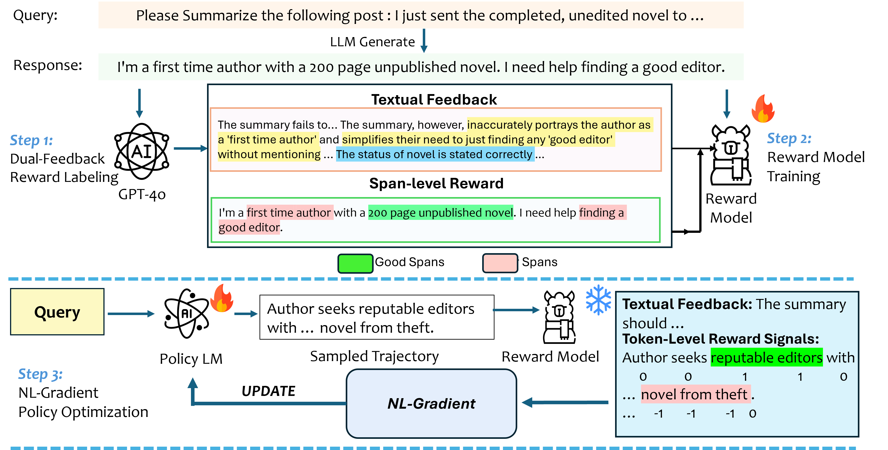

# Text2Grad: Reinforcement Learning from Natural Language Feedback

Text2Grad is a novel approach that enables language models to learn from natural language feedback through reinforcement learning. This project implements a framework that converts textual feedback into gradient signals for model optimization.

## Abstract

Traditional RLHF optimizes language models with coarse, scalar rewards that mask the fine-grained reasons behind success or failure, leading to slow and opaque learning. Recent work augments RL with textual critiques through prompting or reflection, improving interpretability but leaving model parameters untouched. We introduce Text2Grad, a reinforcement-learning paradigm that turns free-form textual feedback into span-level gradients. 

Given human (or programmatic) critiques, Text2Grad aligns each feedback phrase with the relevant token spans, converts these alignments into differentiable reward signals, and performs gradient updates that directly refine the offending portions of the model's policy. This yields precise, feedback-conditioned adjustments instead of global nudges.

## Pipeline Overview



*Figure: The Text2Grad framework pipeline showing the flow from natural language feedback to gradient-based model optimization*

## Framework Components

Text2Grad consists of three main components:

1. **High-Quality Feedback Annotation Pipeline**: Pairs critiques with token spans for precise feedback alignment
2. **Fine-Grained Reward Model**: Predicts span-level rewards while generating explanatory critiques
3. **Span-Level Policy Optimizer**: Back-propagates natural-language gradients for targeted model improvements

## Key Features

- Natural language feedback processing for model training
- Token-level reward assignment from textual spans
- Support for multiple tasks:
  - Summarization
  - Code Generation
  - Question Answering
- Distributed training with DeepSpeed integration
- Flexible model architecture support

## Installation

```bash
# Clone the repository
git clone https://github.com/EdWangLoDaSc/Text2Grad-Reinforcement-Learning-from-Natural-Language-Feedback
cd Text2Grad-Reinforcement-Learning-from-Natural-Language-Feedback

# Install dependencies
bash env.sh
```

## Datasets

We utilize the following open-source datasets in our research:

### Code Generation
**KodCode**
- [KodCode-Light-RL-10K](https://huggingface.co/datasets/KodCode/KodCode-Light-RL-10K): Lightweight reinforcement learning dataset
- [KodCode-V1-SFT-4o](https://huggingface.co/datasets/KodCode/KodCode-V1-SFT-4o): Supervised fine-tuning dataset

### Question Answering
**UltraFeedback**
- [UltraFeedback-Binarized](https://huggingface.co/datasets/HuggingFaceH4/ultrafeedback_binarized): Binary feedback dataset for question-answering tasks

### Summarization
**SLF5K**
- [SLF5K Dataset](https://huggingface.co/datasets/JeremyAlain/SLF5K): Specialized dataset for summarization tasks

> **Note**: All datasets are publicly available on the HuggingFace Hub and are used in accordance with their respective licenses.

## Project Structure

```
/Text2Grad-Reinforcement-Learning-from-Natural-Language-Feedback/
├── RM_Data_Anno/                 # Reward Model Data Annotation
│   ├── KodCode/                  # Code Generation dataset processing
│   ├── SLF5K/                    # Summarization dataset processing
│   └── UltraFeedback/            # Question Answering dataset processing
|
├── NL_Reward_Model/              # Natural Language Reward Model Implementation
│   ├── KodCode/                  # Code Generation reward model
│   ├── SLF5K/                    # Summarization reward model
│   └── UltraFeedback/            # Question Answering reward model
|
├── NL-Gradiant-Policy-Optimization/                  # Natural Language Gradient Implementation
│   ├── KodCode/                  # Code Generation training
│   ├── SLF5K/                    # Summarization training
│   └── UltraFeedback/            # Question Answering training
```

## Usage

### 1. Data Annotation

The annotation pipeline processes raw text feedback into structured training dual-feedback reward data:

```bash
cd RM_Data_Anno/UltraFeedback
# For Question Answering tasks
python RM_Data_Anno/UltraFeedback/dual_feedback_annotation_RM.py \
    --data_path path/to/data
```

### 2. Reward Model Training & Evaluation

#### 2.1 Training Reward Models

To train reward models for different tasks:

```bash
# Code Generation Task
cd NL_Reward_Model/KodCode
bash deepspeed_train_kodcode.sh

# Summarization Task
cd NL_Reward_Model/SLF5K
bash deepspeed_train_slf5k.sh

# Question Answering Task
cd NL_Reward_Model/UltraFeedback
bash deepspeed_train_ultrafeedback.sh
```

#### 2.2 Evaluating Trained Models

Each dataset directory contains an `Evaluation` folder with scripts for model evaluation. Here's an example workflow for the KodCode dataset:

```bash
# Step 1: Navigate to evaluation directory
cd NL_Reward_Model/KodCode/Evaluation

# Step 2: Merge LoRA weights with base model
python 1_merge_lora.py \
    --base_model "meta-llama/Llama-3.1-8B-Instruct" \
    --lora_model "../ckpt/llama31-8B-kodcode/0_4400" \
    --save_dir "../ckpt/llama31-8B-kodcode/0_4400_merge" \
    --merge_and_save True

# Step 3: Run inference on test dataset
python 2_infer.py \
    --model_path "../ckpt/llama31-8B-kodcode/0_4400_merge" \
    --dataset_path "../data/KodCode/kodcode_test.json" \
    --output_file "inference_results_0_4400.json" \
    --batch_size 40 \
    --prompt_max_length 1000 \
    --max_length 1600 \
    --max_new_tokens 350 \
    --gpu_ids "0,1" \
    --gpu_memory "30GiB"

# Step 4: Calculate evaluation metrics
python 3_metrics.py \
    --input_file "inference_results_0_4400.json" \
    --output_file "word_level_evaluation_results.json"
```

> **Note**: Remember to adjust file paths according to your setup before running the evaluation scripts.

The evaluation process consists of three main steps:
1. Merging LoRA weights with the base model
2. Running inference on the test dataset
3. Computing evaluation metrics

Similar evaluation workflows can be followed for other tasks (SLF5K and UltraFeedback) by using their respective evaluation scripts.

### 3. NL-Gradient Policy Optimization
To train a model using Text2Grad:

```bash
# For Code Generation
cd NL-Gradiant/KodCode
bash train_kodcode.sh

# For Question Answering
cd NL-Gradiant/UltraFeedback
bash train_ultrafeedback.sh

# For Summarization
cd NL-Gradiant/SLF5K
bash train_slf5k.sh
```

### 3.1 Evaluation Metrics & Benchmarks

We evaluate our NL-Gradient models using task-specific metrics and benchmarks:

#### Summarization (SLF5K)
We evaluate the model on the 500 validation samples from SLF5K using:
- **Traditional Metrics**:
  - BLEU
  - ROUGE-1
  - ROUGE-2 
  - ROUGE-L
  - BERTScore
  - Perplexity
- **LLM-based Evaluation**:
  - GPT-4 as judge for qualitative assessment
- **Comparative Analysis**:
  - Performance comparison between SFT, PPO, and Text2Grad approaches

#### Code Generation (KodCode)
We use [EvalPlus](https://github.com/evalplus/evalplus) framework for comprehensive evaluation on:
- HumanEval
- HumanEval Plus
- MBPP (Mostly Basic Programming Problems)
- MBPP Plus

#### Question Answering (UltraFeedback)
Evaluation is conducted using multiple benchmarks:
- [MT-Bench](https://github.com/mtbench101/mt-bench-101): Multi-turn conversation benchmark
- [ARC-C](https://arxiv.org/abs/1803.05457): AI2 Reasoning Challenge (Challenge Set)
- [AlpacaEval 2.0](https://github.com/tatsu-lab/alpaca_eval): Comprehensive LLM evaluation suite

> **Note**: All evaluations are performed using standardized metrics and publicly available benchmarks to ensure reproducibility and fair comparison.

## Citation

If you use Text2Grad in your research, please cite:

```bibtex
@inproceedings{wang2025text2grad,
    title={Text2Grad: Reinforcement Learning from Natural Language Feedback},
    author={Wang, Hanyang and Wang, Lu and Zhang, Chaoyun and Mao, Tianjun and Qin, Si and Lin, Qingwei and Zhang, Dongmei},
    booktitle={Advances in Neural Information Processing Systems},
    year={2025}
}
```

### Additional References

For the evaluation frameworks and methods used in this work, please cite:

```bibtex
@inproceedings{evalplus,
    title = {Is Your Code Generated by Chat{GPT} Really Correct? Rigorous Evaluation of Large Language Models for Code Generation},
    author = {Liu, Jiawei and Xia, Chunqiu Steven and Wang, Yuyao and Zhang, Lingming},
    booktitle = {Thirty-seventh Conference on Neural Information Processing Systems},
    year = {2023},
    url = {https://openreview.net/forum?id=1qvx610Cu7}
}

@misc{alpaca_eval,
    author = {Xuechen Li and Tianyi Zhang and Yann Dubois and Rohan Taori and Ishaan Gulrajani and Carlos Guestrin and Percy Liang and Tatsunori B. Hashimoto},
    title = {AlpacaEval: An Automatic Evaluator of Instruction-following Models},
    year = {2023},
    month = {5},
    publisher = {GitHub},
    journal = {GitHub repository},
    howpublished = {\url{https://github.com/tatsu-lab/alpaca_eval}}
}

@article{dubois2024length,
    title = {Length-Controlled AlpacaEval: A Simple Way to Debias Automatic Evaluators},
    author = {Dubois, Yann and Galambosi, Bal{\'a}zs and Liang, Percy and Hashimoto, Tatsunori B},
    journal = {arXiv preprint arXiv:2404.04475},
    year = {2024}
}

@misc{dubois2023alpacafarm,
    title = {AlpacaFarm: A Simulation Framework for Methods that Learn from Human Feedback}, 
    author = {Yann Dubois and Xuechen Li and Rohan Taori and Tianyi Zhang and Ishaan Gulrajani and Jimmy Ba and Carlos Guestrin and Percy Liang and Tatsunori B. Hashimoto},
    year = {2023},
    eprint = {2305.14387},
    archivePrefix = {arXiv},
    primaryClass = {cs.LG}
}
```

## Acknowledgments

- Thanks to all contributors who have helped with the development of Text2Grad
- Special thanks to the open-source community for providing valuable resources and tools
- We appreciate the authors of EvalPlus, AlpacaEval, and other evaluation frameworks for making their code publicly available

## Contributing

Contributions are welcome! Please feel free to submit a Pull Request.
